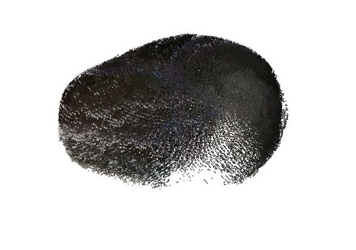
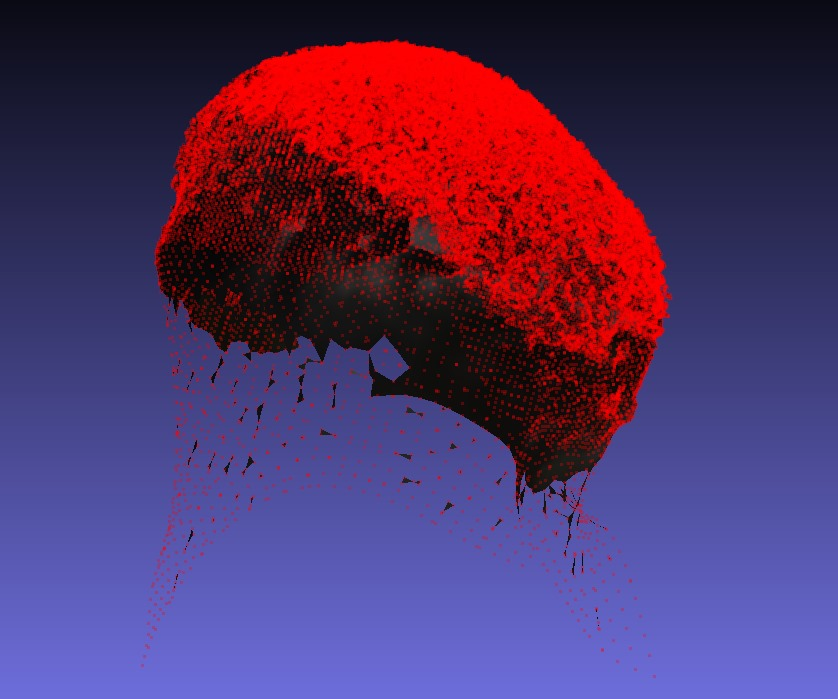
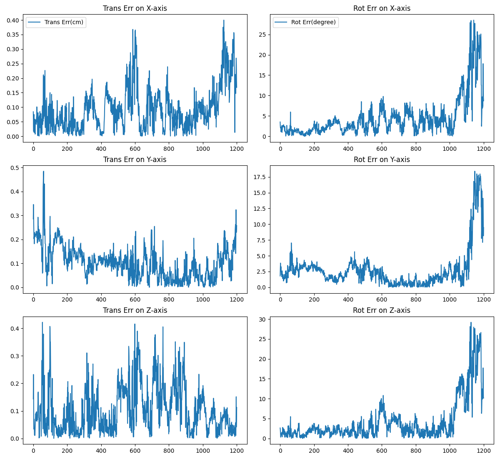
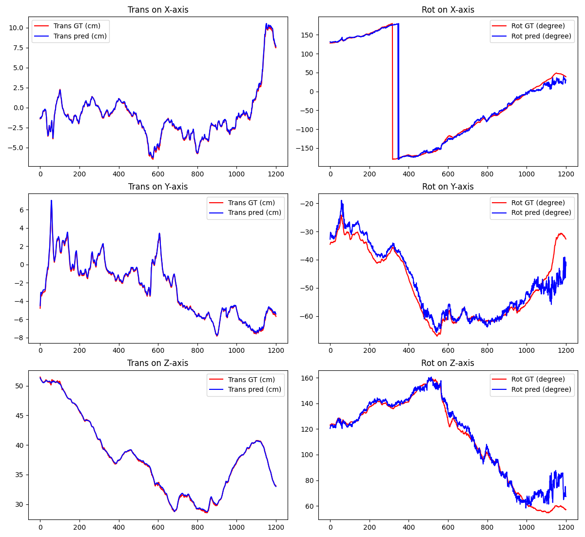

# 🚀 FoundationPose: Unified 6D Pose Estimation and Tracking of Novel Objects


We present FoundationPose, a unified foundation model for 6D object pose estimation and tracking, supporting both model-based and model-free setups. Our approach can be instantly applied at test-time to a novel object without fine-tuning, as long as its CAD model is given, or a small number of reference images are captured. We bridge the gap between these two setups with a neural implicit representation that allows for effective novel view synthesis, keeping the downstream pose estimation modules invariant under the same unified framework. Strong generalizability is achieved via large-scale synthetic training, aided by a large language model (LLM), a novel transformer-based architecture, and contrastive learning formulation. Extensive evaluation on multiple public datasets involving challenging scenarios and objects indicate our unified approach outperforms existing methods specialized for each task by a large margin. In addition, it even achieves comparable results to instance-level methods despite the reduced assumptions.


## 🌟 Quick start

With this one command you can run a demo of the code. If you have your own data repalce the ```TEST_SCENE_DIR``` with the name of your dataset. 
Please place your data in the ```test_data``` folder.

```
make leap-run TEST_SCENE_DIR="avocado_translate_1"
```

- 🥑 avocado_translate_1 is our test dataset. If used the test data is automatically downloaded from here and placed in the ```test_data``` folder by the ```run_container.sh```.
- 🏋️‍♂️ the model files are downloaded from here and placed in the ```weights``` folder by the dockerfile.

The comand of run the evaluation of benchmark:
```
python run_avocado.py --test_scene_dir '${TEST_SCENE_DIR} --compare
```


## 💡 Functionality

### 1. 🔬 Mesh creation:
This repository contains pure python scripts to create object masks, bounding box labels, and 3D reconstructed object mesh (.ply) for object sequences filmed with an RGB-D camera. This project can prepare training and testing data for various deep learning projects such as 6D object pose estimation projects singleshotpose, and many object detection (e.g., faster rcnn) and instance segmentation (e.g., mask rcnn) projects. Ideally, if you have realsense cameras and have some experience with MeshLab or Blender, creating your customized dataset should be as easy as executing a few command line arguments.

This codes in this repository implement a raw 3D model acquisition pipeline through aruco markers and ICP registration. The raw 3D model obtained needs to be processed and noise-removed in a mesh processing software. After this step, there are functions to generate required labels in automatically.

The codes are currently written for a single object of interest per frame. They can be modified to create a dataset that has several items within a frame.

 

A custom mesh of an avocado has been created and provided for the use of this project.

<p style="display: flex; align-items: center; justify-content: space-around;">
  
  
  
</p>

### 2. 🎥 Pose Tracking with RGBD Realsense Camera


### 3. Benchmarking

Benchmarking has been carried out and the error graphs have been created in order to visualise the error.

<p style="display: flex; align-items: center; justify-content: space-around;">
  

</p>

<p style="display: flex; align-items: center; justify-content: space-around;">
  
  
</p>
* x-axis is time(s)

#### Left Image (Error Graphed):
This graph illustrates the error metrics over a series of time intervals. Each line shows how the error rates change over time in each dimention of the 6dof pose. The x-axis indicates time, while the y-axis shows the magnitude of the error.
#### Right Image (Pose 6DoF):
This image depicts a graphical representation of an object in 6 degrees of freedom (6DoF), which includes three translational movements (up/down, left/right, forward/backward) and three rotational movements (pitch, yaw, roll). The red line is the ground truth while the blue line is predicted 6dof pose.

## 🛠️ Prerequisites / Common Debugging 

Before you begin, ensure your system meets the following requirements to make the most of FoundationPose:

- **🐳 Docker**: You must have Docker installed on your system. For GPU support, ensure you're using Docker Engine version 19.03 or newer, which natively supports NVIDIA GPUs via the NVIDIA Container Toolkit.

- **🏗️ NVIDIA Docker Toolkit***: If you plan to utilize GPU acceleration, install the [NVIDIA Container Toolkit](https://github.com/NVIDIA/nvidia-docker) to allow Docker to utilize the GPU directly.

- **🐍 Python 3.8+**: The software is compatible with Python 3.8 or higher. Ensure that your Python environment is set up correctly, preferably managed through virtual environments like `conda` or `venv`.

- **🖥️ CUDA-Compatible GPU Setup**: A CUDA-compatible NVIDIA GPU is necessary to take full advantage of the foundation model's capabilities. Ensure you have the latest compatible NVIDIA drivers and CUDA version installed that match the toolkit requirements.

### Setting Up Docker for GPU Access

1. **Install NVIDIA Drivers**: Ensure you have the latest NVIDIA drivers installed, compatible with your CUDA version.

2. **Install Docker**: If not already installed, you can download and install Docker from the [official site](https://docs.docker.com/get-docker/).

3. **Set up the NVIDIA Container Toolkit**:
   - Add the NVIDIA package repositories:
     ```bash
     distribution=$(. /etc/os-release;echo $ID$VERSION_ID)
     curl -s -L https://nvidia.github.io/nvidia-docker/gpgkey | sudo apt-key add -
     curl -s -L https://nvidia.github.io/nvidia-docker/$distribution/nvidia-docker.list | sudo tee /etc/apt/sources.list.d/nvidia-docker.list
     ```
   - Install the NVIDIA runtime:
     ```bash
     sudo apt-get update
     sudo apt-get install -y nvidia-docker2
     ```
   - Restart the Docker daemon to apply changes:
     ```bash
     sudo systemctl restart docker
     ```

4. **Test NVIDIA Docker Installation**:
   - Run a test container to verify that Docker can access your GPU:
     ```bash
     docker run --rm --gpus all nvidia/cuda:11.0-base nvidia-smi
     ```

   This command should output information about your GPU, confirming that Docker is correctly configured to access the hardware.

### Additional Requirements

- **🌐 Internet Connection**: A stable internet connection is required to download dependencies, Docker images, and datasets.
- **Disk Space**: Ensure you have sufficient disk space, especially for storing large datasets and building Docker images. At least 50 GB of free space is recommended for a full setup.

With these prerequisites met, you can proceed with the installation and setup of the module.
